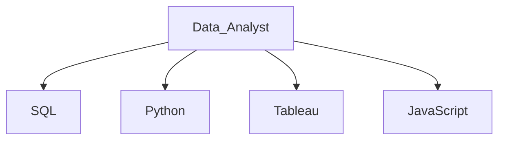
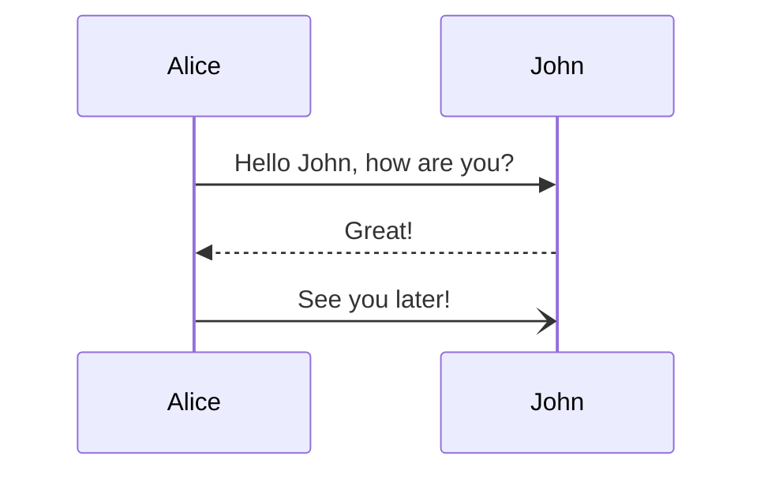

# Julie Pyle | Data Analyst | Education Expert | Tool Creator  

- 👋 Hi, I’m @Baylex and I own Weighted Averages, LLC, a company committed to helping school districts streamline and analyze their data by creating tools to do the heavy lifting, so educators can do what they do best, inspire students. 
- 👀 I’m interested in studying state accountability and creating tools for educators.
- 🌱 I’m currently focusing on Tableau, Python programming, and embedding Excel into websites with JavaScript.
- 💞️ I’m looking to collaborate on machine learning models centered on analyzing educational data sets.
- 📫 Hire me! [Julie Pyle, M. Ed.](hwww.linkedin.com/in/juliempyle)   
- 📫 Open to contracted work: [Weighted Averages, LLC](https://www.linkedin.com/company/weighted-averages-llc) 
- 📫 Check out my results and let's chat about how I can solve problems for your team! Email: jp3158@gmail.com
 
## I solve Real World problems!  
### Projects for Transformation Waco  

#### [Two Embedded TIA Estimators](https://github.com/Baylex/TW_Estimators)  <-- Want to know how I think analytically to solve problems? 
I designed two qualification calculators to help teachers understand their eligibility for the Teacher Incentive Allotment, a potential $65,000 pay increase!    

#### [Sentiment Analysis NLP](https://github.com/Baylex/TW_Survey_NLP)  Code coming soon!  <-- What tools do I use and how do I masterfully pull them together for a long project? 
I have streamlined our data collection process and have recovered 1000 work hours or roughly $45,000 in salaries plus created actionable data from previously ignored data attributes.  

#### [Bernie Sanders Meme - Converting Images](https://github.com/Baylex/TW_Bernie_Sanders_Converting_Images)   
I used Python to convert several logo images for a communication flyer.  The communication team wanted the logos to match with the same black and white color scheme.   

### Volunteer Projects for my Community
How I overcame the challenges of finding Child Care - in the works with collaborating with United Way and HOT Workforce Solutions.    
[Texas Child Care Facilities Tableau](https://public.tableau.com/app/profile/julie.pyle2236/viz/TexasChildCareFacilities/Story1)    
[Texas Child Care Facilities Python](https://github.com/Baylex/child_care)    

## My work has Impact and Reach! 
### Projects for Educational Service Center Region 13, Austin, TX

#### [Data Dig Protocol eStore $1200/download](https://store.esc13.net/collections/frontpage/products/data-dig-protocol-tool?variant=39316497727561)
I was contracted to bring the Data Dig Protocol to life, which retails for $1200.  I used Google Sheets to create a collaborative document that takes in data from 2 different student information systems, Eduphoria! and DMAC, which are the  2 most common SIS in Texas.  Once the data is in place, I wrote the necessary code and formulas to automatically calculate and present everything the way a teacher needs to process the information.  The result being that teachers save countless hours of manual data entry, and the tool gets them straight into the analysis and discussion of actionable steps to improve instructional practices to benefit student performance.

#### [STAAR Growth Prediction Tool](https://www.youtube.com/watch?v=ofBWVEwAAjI&ab_channel=ESCRegion13)
I saw a knowledge gap where teachers had too much difficulty learning the new growth model when TEA shifted to the A-F Accountability system.  I created data tables and excel files that make setting growth goals easy!  

[STAAR Growth Prediciton Tool eStore $50 - $130/download](https://store.esc13.net/products/staar-growth-predicition-tool-middle-school-bundle-downloadable-pdf?_pos=4&_sid=e7fd7d504&_ss=r&variant=15824492003401)

## Real Results! 
In this clip, you can see Elgin ISD using my tools to improve student performance! 

More evidience: See several more schools that my tools have impacted! 

# Repos from my UT McCombs Data Analytics Boot Camp  

## Final Project  
[Final Project](https://github.com/Baylex/Video_Game_Sales)   

## Modules  
1. [Mapping Earthquakes - GeoJSON, API, D3, JavaScript](https://github.com/Baylex/Mapping_Earthquakes)  
2. [Mission to Mars - HTML, BeautifulSoup, Splinter, MongoDB, Glask, CSS, Bootstrap](https://github.com/Baylex/Mission-to-Mars)    
3. [School District Analysis - Python, Cleaning DataFrames, Groupby(), Pandas, Numpy](https://github.com/Baylex/School_District_Analysis_Challenge)   
4. [Election Analysis - Python, Boolean & Logical operators, Calculations using data types](https://github.com/Baylex/Election_Analysis_Challenge)     
5. [Kickstarter Analysis - Excel, Graphs, Analysis, Interpretation, Statistics](https://github.com/Baylex/Kickstarter_Analysis_Challenge)    
6. [Stock Analysis - VBA, Loops, Optimization](https://github.com/Baylex/Stock_Analysis)  
7. [Neural Network Charity Analysis - neural network model, Machine Learning classification, TensorFlow, Deep Neural Networks](https://github.com/Baylex/Neural_Network_Charity_Analysis)   
8. [World Weather Analysis](https://github.com/Baylex/World_Weather_Analysis)   
9. [Cryptocurrencies](https://github.com/Baylex/Cryptocurrencies)   
10. [Amazon Vine Analysis](https://github.com/Baylex/Amazon_Vine_Analysis)   
11. [Credit Risk Analysis](https://github.com/Baylex/Credit_Risk_Analysis)   
12. [MechaCar Statistical Analysis](https://github.com/Baylex/MechaCar_Statistical_Analysis)  
13. [Citibike](https://github.com/Baylex/Citibike)   
14. [Plotly Biodiversity](https://github.com/Baylex/Plotly_Biodiversity)   
15. [UFOs](https://github.com/Baylex/UFOs)   
16. [Surf's Up](https://github.com/Baylex/surfs_up)  
17. [Movies ETL Process](https://github.com/Baylex/Movies-ETL)   
18. [Pewlett Packard Analysis](https://github.com/Baylex/Pewlett_Hackard_Analysis)    
19. [PyBer Analysis](https://github.com/Baylex/PyBer_Analysis)   

Saw a new markdown feature and tried it out: [Mermaid](https://github.blog/2022-02-14-include-diagrams-markdown-files-mermaid/)

Practice embedding hyperlinks

# Other  
[Light Density](https://github.com/Baylex/Light_Density)  
[Practice](https://github.com/Baylex/Pages_practice)

# Forked
https://github.com/Baylex/Best-README-Template   
https://github.com/Baylex/storytelling-with-data-ggplot   
https://github.com/Baylex/storytelling-with-data-1   
https://github.com/Baylex/storytelling-with-data   

# Portfolio - Work in Progress   
[Portfolio](https://github.com/Baylex/Portfolio)
